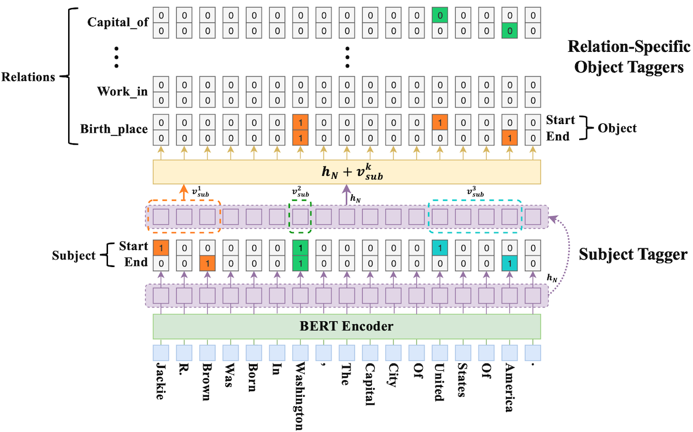

# BERT-CasRel 实体关系抽取

## 项目说明

本项目采用 **BERT + 层叠式指针标注框架（CasRel）** 实现实体关系抽取。模型来自 [weizhepei/CasRel](https://github.com/weizhepei/CasRel) 。

该模型属于 Joint Model，由实体识别和关系分类两部分组成，实体和关系共享一个 encoder，解码用两个 decoder，并只计算一次损失。

### 实现效果

```python
文本：
周杰伦以音乐人出道，跨界执导电影第一部作品《不能说的秘密》就赢得口碑票房双丰收 时隔6年，他带来第二部自导自演电影作品《天台爱情》（原名《天台》） 这部诚意之作《天台爱情》由恒大影视、唐德国际、创映电影、安乐影片联合出品，将于7月11日正式在全国院线上映，同期献映香港、台湾、东南亚及北美地区，全球即将席卷刮起《天台》风潮，燃爆暑期嘉年华 -------我是小尾巴~

[('天台爱情', '出品公司', '唐德国际'), 
('天台爱情', '上映时间', '7月11日'), 
('天台爱情', '出品公司', '恒大影视'), 
('天台爱情', '出品公司', '安乐影片'), 
('天台爱情', '导演', '周杰伦'), 
('天台爱情', '出品公司', '创映电影'), 
('天台爱情', '主演', '周杰伦')]
```

## 项目环境

Python, PyTorch, Transformers

相关库安装`pip install -r requirement.txt`。

## 项目目录

```
Bert_CasRel_RE
    ├─ config.py             配置文件
    ├─ data                  数据
    │    ├─ input            数据集存放位置
    │    └─ output           输出数据
    │           └─ models    保存的模型
    ├─ figures               训练过程的可视化图像
    ├─ model.py              模型文件
    ├─ predict.py            预测文件
    ├─ process.py            预处理文件
    ├─ requirements.txt      需求文件
    ├─ test.py               测试文件
    ├─ train.py              训练文件
    └─ utils.py              工具函数
```

## 模型结构

CasRel 模型分为两部分，一部分负责预测 subject 实体位置，另一部分负责预测 relation 和 object 的实体位置矩阵。



## 数据集

DuIE 2.0 是业界规模最大的中文关系抽取数据集，其 schema 在传统简单关系类型基础上添加了多元复杂关系类型，此外其构建语料来自百度百科、百度信息流及百度贴吧文本，全面覆盖书面化表达及口语化表达语料，能充分考察真实业务场景下的关系抽取能力。

该数据集有 48 个已定义好的 schema，43 个简单知识 schema，5 个复杂知识的 schema；共有 11958 条训练数据、1498 条验证数据和 1489 条测试数据。

## 数据预处理

运行`process.py`，解析实体关系 json 文件并输出为 csv 文件。

## 损失函数

subject 部分的损失函数分别为首/尾索引的二元交叉熵，relation 和 object 部分的损失函数为 48（relation 的总数）个首/尾索引的二元交叉熵；其中 subject 部分的损失函数需要乘以权重参数来解决目标值不均衡的问题。最后将四部分求和即为模型整体的损失。

## 训练和测试

运行`train.py`和`test.py`。

学习率为 1e-5，batch size 为 8，训练 10 个 epoch，测试时使用自定义的评估函数进行评估，最终F1得分为 0.702，三元组提取结果较好。

## 预测

运行`predict.py`。
