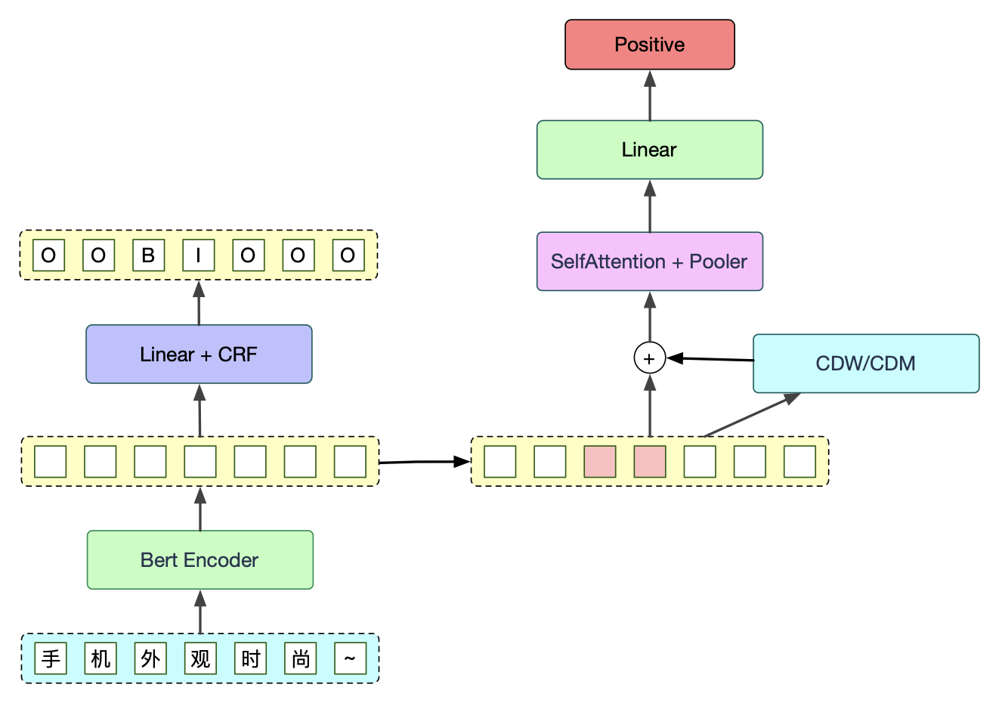

# BERT-LCF-ATEPC 属性级情感分析 

## 项目说明

本项目采用**BERT + 局部上下文特征（LCF） + 属性提取和属性情感分类联合模型（ATEPC）**来实现对电商平台用户评价的**属性级情感分析（ABSA）**，模型参考自 [yangheng95/LCF-ATEPC](https://github.com/yangheng95/LCF-ATEPC)，对原模型进行了精简。

实现效果：

```python
文本：这个手机系统很流畅，拍照效果也很好，但是20W充电属实有点慢。

[{'aspect': '系统', 
'sentiment': 'Positive', 
'position': [5, 6]}, 

{'aspect': '拍照效果', 
'sentiment': 'Positive', 
'position': [11, 12, 13, 14]}, 

{'aspect': '充电', 
'sentiment': 'Negative', 
'position': [24, 25]}]
```

## 项目环境

Python, PyTorch, Transformers

相关库安装`pip install -r requirement.txt`。

## 项目目录

```
Bert_LCF_ATEPC_ABSA
    ├─ config.py           配置文件
    ├─ figures             训练过程的可视化图像
    ├─ input               数据集存放位置
    ├─ model.py            模型文件
    ├─ output              输出数据
    │    ├─ models         保存的模型
    │    └─ process        预处理后的数据
    ├─ predict.py          预测文件
    ├─ process.py          预处理文件
    ├─ requirements.txt    需求文件
    ├─ test.py             测试文件 
    ├─ train.py            训练文件
    └─ utils.py            工具函数
```

## 模型结构

模型分为两部分：属性提取（实体BIO标签预测）和 BertAttention 情感分类。其中属性提取部分加入 CRF 来提升实体识别的准确率。



## 数据预处理

运行`process.py`将样本处理成一句一行的形式，并剔除异常数据。

## 训练和测试

运行`train.py`和`test.py`。

学习率为1e-4，batch size 为50，LCF 模式使用上下文动态权重（CDW），训练100个epoch。测试需要从预测值中解析出实体位置，并预测对应的情感分类，再手动计算各项评估指标。最终F1得分为0.802，预测效果较好。

## 预测

运行`predict.py`。
